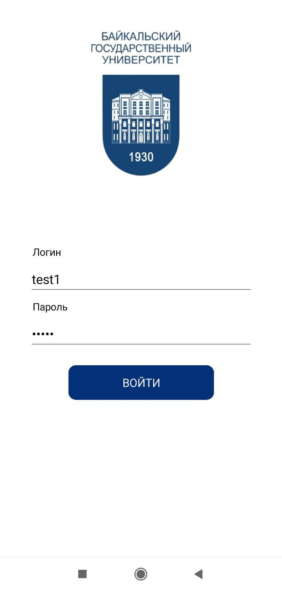
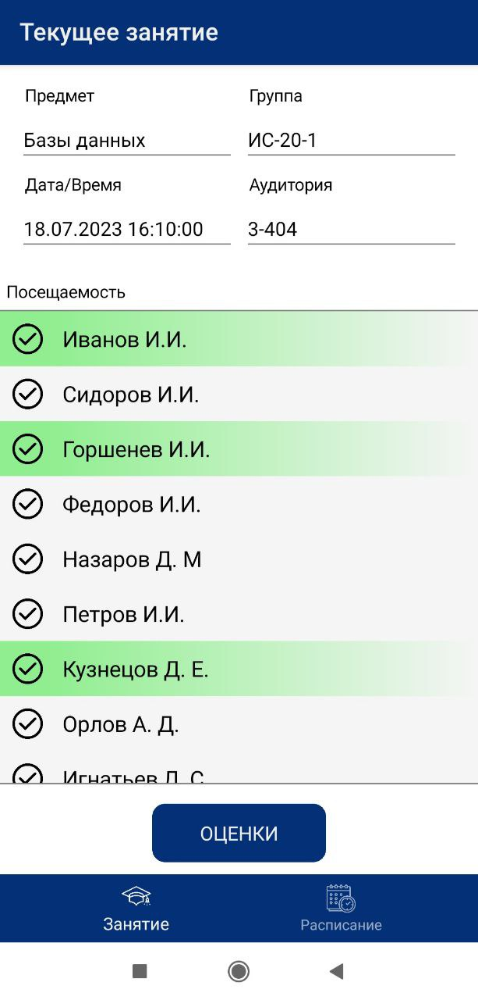
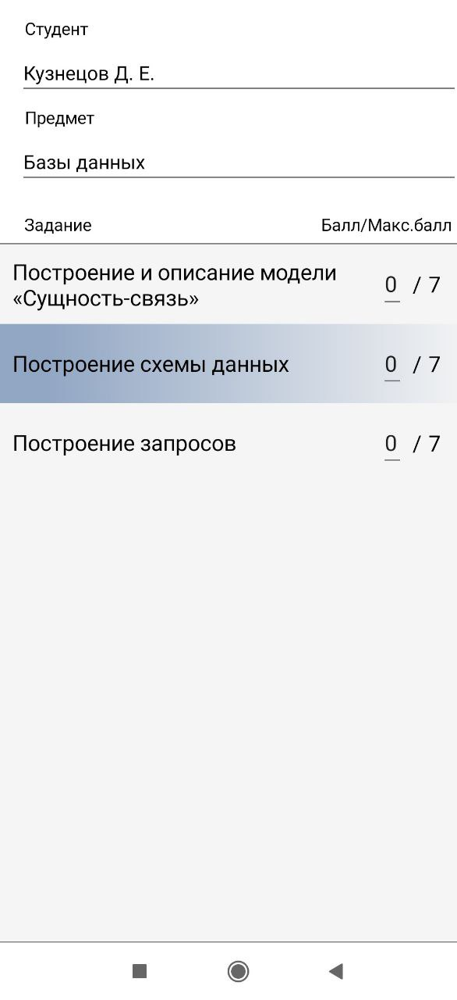
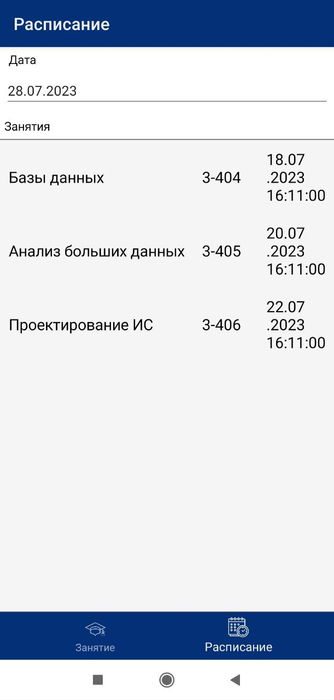

# TeacherApp-Client
Мобильное приложение преподавателя университета
## Решаемые задачи
1. Позволяет вносить посещаемость и успеваемость студентов
2. Отслеживать расписание занятий

## Технологический стек
- C#
- Xamarin.Forms
## Архитектура
- MVVM
## Скриншоты

